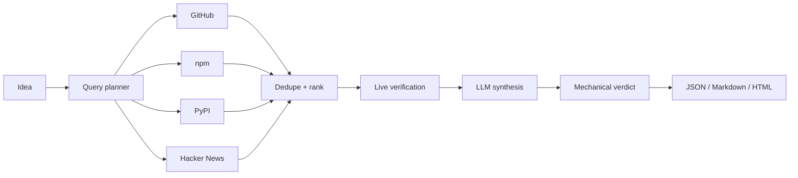

# GithubPill

[](https://github.com/suleman-dawood/githubpill/actions/workflows/tests.yml)

Prior-art reconnaissance for project ideas. Describe an idea; GithubPill
searches several sources, synthesizes what it finds with an LLM, verifies
every cited URL live, and returns a verdict:

```
🟢  No close match — your idea looks novel
🟡  Some overlap — worth a closer look
🔴  Strong overlap — someone has likely shipped this
```

## Modes

| Mode | Question it answers | Command |
|---|---|---|
| **Validate** (default) | Does this already exist? | `githubpill "<idea>"` |
| **Validate, deep** | ...and what does the source actually do? | `githubpill --deep "<idea>"` |
| **Explore** | What is the shape of this space, and where is the opening? | `githubpill --explore "<space>"` |
| **Explore, deep** | ...grounded in the top projects' source | `githubpill --deep --explore "<space>"` |

Validate retrieves prior art, scores overlap, and returns the verdict. Deep
mode additionally clones the strongest candidates and cites `path:LINE`
evidence from their source. Explore clusters the retrieved field, states what
none of the retrieved projects does, and proposes grounded directions. The two
combine: `--deep --explore` grounds the exploration in real source.

## Why

People build things that already exist because validation is usually a vibe.
GithubPill answers "does this exist?" with evidence: multi-source retrieval, a
scored overlap analysis, and citations that were checked live — dead links are
dropped before they reach a report.

## How it works



- **Adapters** (`src/adapters/`) are the only source-specific code. Each
  implements one interface — `search` and `verify` — so adding a source is a
  single file plus a registry entry.
- **Retrieval** (`src/retrieval/`) plans queries, fans out with bounded
  concurrency, isolates per-query failures, then dedupes by canonical URL and
  ranks by how many independent searches surfaced each candidate.
- **Synthesis** (`src/synthesis/`) sends the candidates to an LLM and gets
  back axis scores plus rationale, validated against a Zod schema. Providers
  are strategies behind one `LLMClient` interface (Anthropic, OpenAI, Gemini,
  DeepSeek), built by a factory from validated config. The LLM never emits a
  verdict label: labels and the overall band are derived mechanically from the
  scores, so identical scores always give identical verdicts.
- **Verification** (`src/verify/`) re-checks every candidate live and drops the
  ones that fail — the citation-integrity gate.
- **Deep mode** (`src/deep/`) clones the strongest candidates (shallow, blobless,
  timeout-guarded), selects and sanitizes their source files, and checks every
  cited `path:LINE` against the clone. A strong match with no surviving citation
  is capped, so the verdict never rests on invented evidence.
- **Reports** (`src/report/`) render JSON, Markdown, and a self-contained HTML
  report with verification badges and axis bars.

## Install

```bash
npm install -g githubpill     # install
npx githubpill "<idea>"       # or run without installing
```

Requires Node ≥ 20 and one LLM API key. The provider is auto-detected from
whichever key is present, or set explicitly with `--provider` /
`GITHUBPILL_PROVIDER`:

| Provider | API key env | Default model |
|---|---|---|
| `anthropic` | `ANTHROPIC_API_KEY` | `claude-sonnet-4-5` |
| `openai` | `OPENAI_API_KEY` | `gpt-4o` |
| `gemini` | `GEMINI_API_KEY` or `GOOGLE_API_KEY` | `gemini-2.0-flash` |
| `deepseek` | `DEEPSEEK_API_KEY` | `deepseek-chat` |
| `host` | none — uses an installed agentic CLI | — |

If no API key is set, GithubPill falls back to the **`host`** provider and
drives the agentic CLI already on your machine (`claude`, `opencode`, `codex`,
or `pi`) to do the reasoning, so it works with **no API key**. Set
`GITHUBPILL_AGENT` to choose one explicitly.

```bash
export ANTHROPIC_API_KEY=...        # or OPENAI_API_KEY / GEMINI_API_KEY / DEEPSEEK_API_KEY
export GITHUB_TOKEN=...             # optional; raises GitHub rate limits
```

A `*_BASE_URL` variable per provider (e.g. `OPENAI_BASE_URL`) points the client
at a gateway or proxy. Without `GITHUB_TOKEN`, GithubPill falls back to your
`gh auth token`; the GitHub search API is heavily rate-limited when anonymous,
so a token is strongly recommended.

## Use

```bash
githubpill "a CLI that previews diffs as a side-by-side TUI"
```

```bash
githubpill --json --html "a self-hosted RSS reader"   # extra report formats
githubpill --deep "a self-hosted RSS reader"          # clone + file:LINE evidence
githubpill --provider openai "a dotfiles manager"     # pick the LLM provider
githubpill --sources github,npm "a dotfiles manager"  # restrict sources
githubpill --explore "local-first note taking"        # landscape + directions
githubpill --deep --explore "local-first note taking" # ...with cloned evidence
```

The verdict block goes to stdout; progress goes to stderr. Reports land in
`githubpill-reports/` (one per idea):

```
🔴 This already exists — 3 strong matches found

Your idea: "a CLI that previews diffs as a side-by-side TUI"
- banga/git-split-diffs — LIKELY_MATCH (sum=13) https://github.com/banga/git-split-diffs
- so-fancy/diff-so-fancy — WORTH_INSPECTING (sum=9) https://github.com/so-fancy/diff-so-fancy

Report: githubpill-reports/2026-05-27-a-cli-that-previews-diffs-as-a-side-by-s.md
```

## Use from an agent

The skill in `skills/githubpill/` is a thin wrapper that runs the CLI, so it
works in any host that supports the Agent Skills standard — Claude Code,
opencode, Codex CLI, Cursor, pi, and others. `install.sh` detects the CLIs on
your machine and installs the skill into each:

```bash
bash install.sh            # every detected CLI, user scope
bash install.sh --project  # this repo's agent configs
bash install.sh --list     # show targets, install nothing
```

## Development

```bash
npm install
npm run typecheck     # tsc --noEmit
npm test              # vitest — offline, no network, no API keys
npm run build         # emit dist/
node dist/cli.js "an idea"
```

Tests never touch the network or an LLM: adapters are exercised with a mocked
`fetch`, and the LLM client is exercised against a local mock server. See
[AGENTS.md](./AGENTS.md) for the architecture rules.

## Releasing

Merging to `main` runs `.github/workflows/release.yml`: it typechecks, tests,
builds, bumps the patch version, publishes to npm, pushes the bump commit and
tag, and creates the GitHub release. Add `[skip release]` to a merge commit to
skip it, or run the workflow manually from the Actions tab.

The workflow needs an `NPM_TOKEN` repository secret. On a 2FA-enabled account
it must be a classic **Automation** token (or a granular token with "Bypass
2FA" enabled); a classic **Publish** token is rejected with `E403` because it
still requires a one-time password.

Because it pushes the version bump back to `main`, branch protection must allow
the Actions token to write, or you must pass a personal access token instead.

## Roadmap

- **Eval harness** — golden cases in `eval/` (ideas with known competitors) run
  on a schedule to measure recall@k, citation-integrity, and verdict accuracy.
- **Retrieval depth** — embeddings + pgvector for semantic re-ranking.
- **More sources** — crates.io, VS Code Marketplace, Product Hunt.
- **Service surface** — a REST API, a job queue with progress, and a report
  viewer over the same engine.

## Limitations

- GitHub is searched with the repo-search API; very new or unindexed projects
  can be missed.
- npm and PyPI coverage depends on their public search; PyPI search is parsed
  from the website because no JSON search API exists.
- Explore reports only what the retrieval surfaced; "no retrieved project does
  X" is not a claim that nothing does.
- Deep mode clones GitHub candidates only; npm and PyPI candidates keep their
  metadata judgement.
- The verdict is decision support, not a substitute for your own judgment.

## License

MIT License
